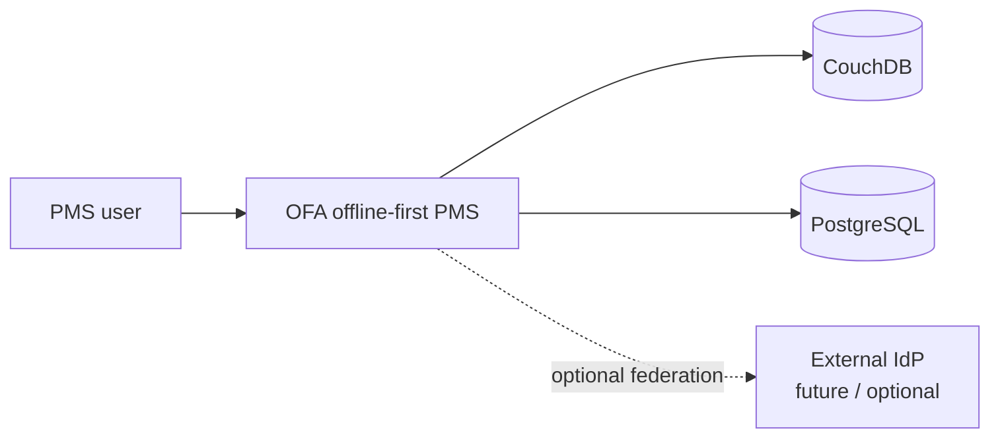
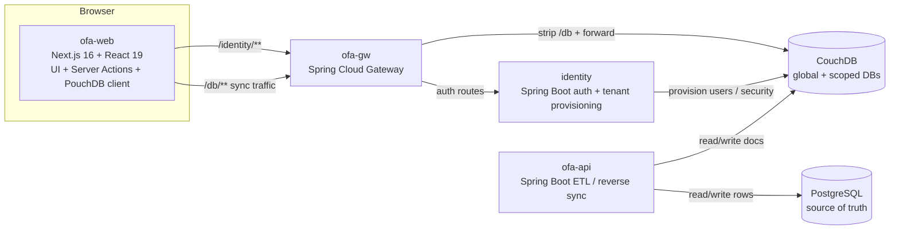
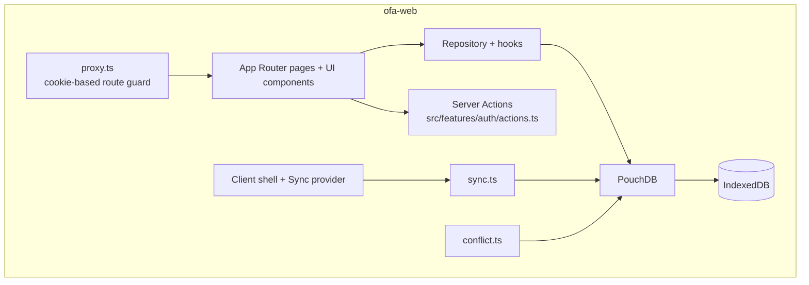
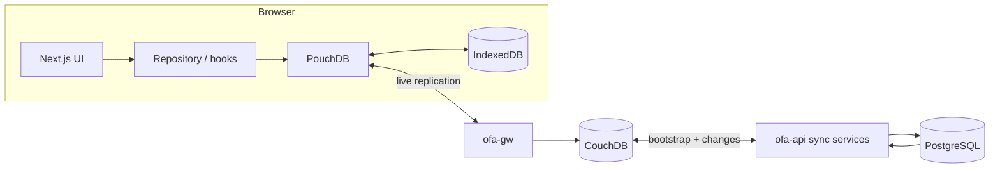
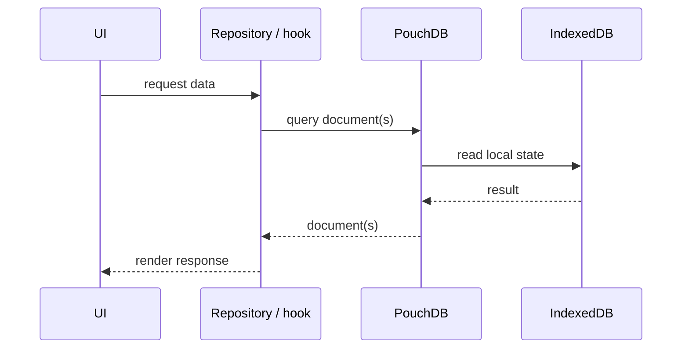
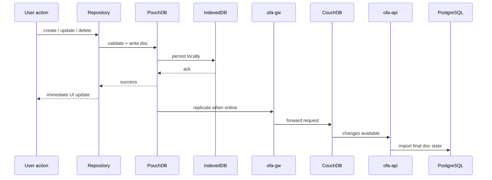
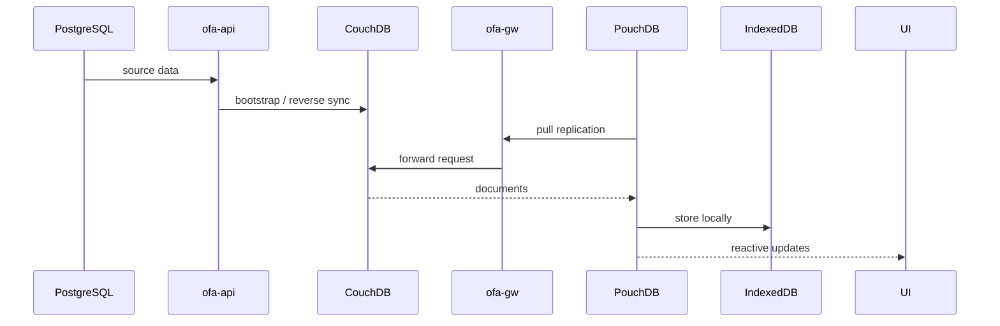
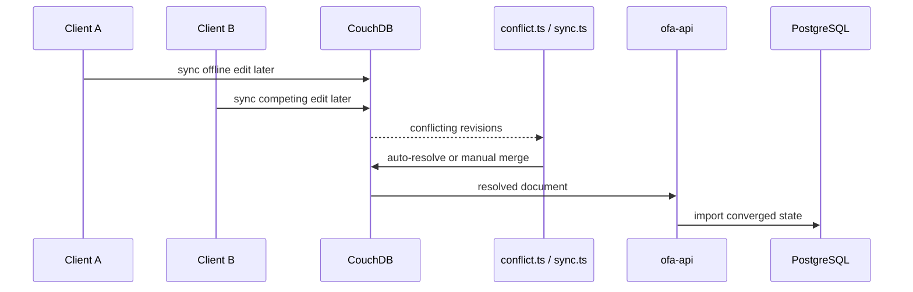

# Architecture

System architecture for the OFA offline-first Property Management System.

## Audience

Developers working on `ofa-web`, `ofa-gw`, `identity`, or `ofa-api`. Read this document to understand the offline-first client model, auth boundary, sync path, and backend responsibilities.

## What this system is

OFA is an offline-first PMS proof of concept.

The browser is the primary working surface. The app reads and writes local data through PouchDB first. PouchDB stores documents in IndexedDB and replicates with CouchDB when connectivity is available. Backend services treat PostgreSQL as the source of truth and synchronize data between PostgreSQL and CouchDB.

## Core principles

- The browser reads and writes local data first.
- IndexedDB is the browser persistence layer.
- CouchDB is the sync relay and shared document store.
- PostgreSQL is the source of truth.
- `ofa-api` synchronizes data between CouchDB and PostgreSQL.
- `ofa-gw` fronts identity and CouchDB endpoints for the web app.
- `identity` authenticates users, resolves tenant context, and provisions CouchDB access.

## System context (C4 level 1)



## Container view (C4 level 2)



## Component view: browser runtime (C4 level 3)



## Main runtime topology



## Authentication and access flow

The app separates sign-in from sync data access.

### Auth path

1. The user submits credentials in `ofa-web`.
2. `ofa-web` calls Server Actions in `ofa-web/src/features/auth/actions.ts`.
3. Server Actions call `ofa-gw` on `/identity/**`.
4. `ofa-gw` forwards to `identity`.
5. `identity` runs the login processor chain:
   1. `TenantValidationProcessor`
   2. `UserAuthenticationProcessor`
   3. `RoleResolutionProcessor`
   4. `TokenGenerationProcessor`
6. `identity` returns access and refresh tokens.
7. `ofa-web` stores tokens in httpOnly cookies: `ofa_access_token`, `ofa_refresh_token`.
8. `ofa-web/proxy.ts` protects routes by cookie presence.
9. `ofa-gw` validates JWTs against the identity JWKS endpoint.

### CouchDB access path

1. Browser sync targets `/db/**` through `ofa-gw`.
2. `ofa-gw` strips `/db` before forwarding to CouchDB.
3. Gateway forwarding removes the browser `Cookie` header.
4. `CouchedbAuthorizationFilterFactory` derives upstream CouchDB auth headers from the authenticated JWT context.
5. CouchDB accepts or rejects the request based on the effective database access.

> **Note:** Current gateway auth injection is still implementation-in-progress. `ofa-gw/src/main/java/vn/com/primetech/ofagw/security/CouchedbAuthorizationFilterFactory.java` currently sets `X-Auth-CouchDB-*` headers with placeholder admin-oriented values and an HMAC token, while identity already exposes RSA/JWKS-based JWT verification for OFA auth.

## Offline-first data flow

### Read path



Reads do not depend on network availability if the required documents already exist locally.

### Write path



Local success is the first success condition. Server synchronization follows the local write.

### Bootstrap path



This path seeds the browser with server-side state when local data is empty or stale.

### Conflict path



PostgreSQL remains the final authority even though conflict handling starts in the client/CouchDB layer.

## End-to-end data flow

### Property created in browser

```text
Browser UI
  → `property-repository.ts`
  → PouchDB local write
  → IndexedDB durable local state
  → `sync.ts` replication via `ofa-gw`
  → CouchDB document
  → `ofa-api` SyncService / PropertySyncService
  → PostgreSQL row
```

### Server-side data reaches browser

```text
PostgreSQL change
  → `ofa-api` ReverseSyncService
  → CouchDB document update
  → browser live sync pull via `ofa-gw`
  → PouchDB update
  → React hooks changes feed
  → UI rerender
```

### Login plus tenant DB provisioning

```text
Login request
  → `ofa-gw`
  → `identity` auth chain
  → tenant context resolution
  → CouchDB user / security provisioning
  → JWT issuance
  → httpOnly cookies in `ofa-web`
  → subsequent `/db` access via gateway
```

## Runtime behavior in `ofa-web`

`ofa-web/src/lib/db/sync.ts` drives sync from the browser.

- It builds sync targets from `NEXT_PUBLIC_COUCHDB_GLOBAL_DB` and tenant-scoped DB names derived from JWT claims.
- It checks `/db/_up` through the gateway before opening replication.
- It sends bearer tokens on sync requests.
- It retries failed sync connections with exponential backoff and jitter.
- It attempts token refresh after `401` or `403` responses.
- It tracks aggregate sync state across all configured targets: `idle`, `syncing`, `synced`, `error`, `offline`, `retrying`.

## Offline behavior

| Scenario | Result |
|---|---|
| Browser online, CouchDB reachable | Local read/write plus background replication |
| Browser offline | Local read/write continues against IndexedDB |
| Browser reconnects | Sync health check runs, then replication restarts |
| Access token expires during sync | Client refreshes token, then retries authenticated sync |
| Same document edited in multiple clients | CouchDB stores conflict branches, then client/server converge |
| Hard refresh while offline | Local DB persists, but app shell still depends on uncached web assets |

> **Note:** This POC does not currently rely on a service worker for full app-shell offline delivery. The offline-first guarantee applies to local data behavior, not complete static asset caching.

## Service responsibilities

| Service | Responsibility |
|---|---|
| `ofa-web` | UI, auth actions, local-first reads/writes, sync lifecycle, conflict UX |
| `ofa-gw` | Web ingress, `/identity/**` and `/db/**` routing, JWT validation, upstream CouchDB header mediation |
| `identity` | Login, refresh, JWT issuance, JWKS exposure, tenant context, CouchDB user/security provisioning |
| `ofa-api` | ETL import from CouchDB, reverse sync from PostgreSQL, checkpointing |
| CouchDB | Shared sync store, replication endpoint, conflict retention |
| PostgreSQL | Source of truth for business data |

## Key code locations

| Area | Files |
|---|---|
| Browser auth | `ofa-web/src/features/auth/actions.ts`, `ofa-web/proxy.ts` |
| Browser sync | `ofa-web/src/lib/db/sync.ts`, `ofa-web/src/components/providers/sync-provider.tsx` |
| Browser conflicts | `ofa-web/src/lib/db/conflict.ts` |
| Browser DB model | `ofa-web/src/lib/db/index.ts`, `ofa-web/src/lib/db/schema.ts` |
| Gateway CouchDB proxy | `ofa-gw/src/main/resources/application.yaml`, `ofa-gw/src/main/java/vn/com/primetech/ofagw/security/CouchedbAuthorizationFilterFactory.java` |
| Identity auth | `identity/src/main/java/com/primetech/poc/identity/features/auth/` |
| Identity RSA / JWKS | `identity/src/main/java/com/primetech/poc/identity/shared/jose/` |
| Identity multi-tenancy | `identity/src/main/java/com/primetech/poc/identity/shared/multitenancy/` |
| Identity CouchDB integration | `identity/src/main/java/com/primetech/poc/identity/shared/couchdb/` |
| API sync | `ofa-api/src/main/java/com/primetech/poc/ofaapi/features/sync/application/` |

## Deployment shape for local development

```text
Developer machine
├── Browser
├── ofa-web dev server
├── ofa-gw
├── identity
├── ofa-api
├── CouchDB container
└── PostgreSQL container
```

`compose.yaml` starts PostgreSQL, CouchDB, and the CouchDB init container. Spring services and the Next.js app run separately during development.

## Related documents

- [README.md](../README.md)
- [pouchdb-couchdb-sync.md](./pouchdb-couchdb-sync.md)
- [etl-sync.md](./etl-sync.md)
- [architecture/authentication.md](./architecture/authentication.md)
- [couchdb docs](./couchdb/)
